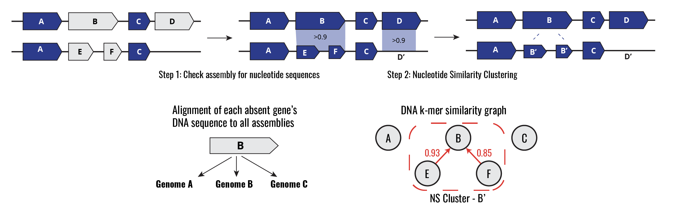

[](https://opensource.org/licenses/MIT)
<!---[]()
[]()
[]()
--->

A toolkit for evaluating nucleotide redundancy in pan-genome analyses.

<!---
> TBD Reference
--->

[TOC]: #
## Table of Contents
- [Motivation](#motivation)
- [Installation](#installation)
  - [`conda`](#conda)
  - [Build locally](#build-locally)
- [Basic usage](#basic-usage)
- [Full usage](#full-usage)
  - [`asmseqcheck`](#asmseqcheck)
  - [`ava`](#ava)
  - [`nscluster`](#nscluster)
- [Contributing and Issues](#contributing-and-issues)
- [Citing](#citing)


## Motivation


The Nucleotide Redundancy Correction (PGQC-NRC) pipeline adjusts for redundancy at the DNA level in two steps (Methods). In step one, all genes predicted to be absent at the Amino Acid (AA) level are compared to their corresponding assembly at the nucleotide level. In cases where the nucleotide sequence is found with high coverage and sequence identity (Query Coverage & Sequence Identity > 90%), the gene is marked as “present at the DNA level”. Next, all genes are clustered and merged using a k-mer based metric of nucleotide similarity. Cases where two or more genes are divergent at the AA level but highly similar at the nucleotide level will be merged into a single “nucleotide similarity gene cluster”. After applying this method the pan-genome gene presence matrix is readjusted according to these results.

<!---
**When to use this software**:
**When you should probably NOT use this software:** If you care about... 
--->

## Installation
### Build locally
>🚧 Check back soon 🚧

### `pip`
Currently, `panqc` can be installed by cloning this repository and installing with `pip`.

```
git clone git@github.com:maxgmarin/pgqc.git

cd pgqc

pip install . 
```

### `conda`
>🚧 Check back soon 🚧

## Basic usage
>🚧 Check back soon 🚧

## Full usage
`panqc` has 3 sub-commands:
- `asmseqcheck` - Perform alignment of all absent genes to all assemblies used in a pan-genome analysis.
- `ava` - Perform all vs all comparison of k-mer profile of all gene sequences of a pan-genome.
- `nscluster` - Perform nucleotide similarity clustering of pan-genome.

---

### `asmseqcheck`
Perform alignment of all absent genes to all assemblies used in a pan-genome analysis. 

#### Usage:
```
pgqc asmseqcheck [-h] -a <tsv> -r <fasta> -m <csv> -o <csv> [-c <0-1>] [-i <0-1>]
```
#### Input:
This software takes three files:
- The paths to the input assemblies
- Pan-genome nucleotide reference
- Pan-genome gene presence/absence matrix

#### Output:
The output (`-o`) is a pan-genome gene presence/absence matrix with updated gene presence/absence calls.
The calls are as follows:
- `0`: 
- `1`: 
- `2`: Similar gene sequence is present at the nucleotide level.

#### Required arguments:

##### `-a`, `--in_assemblies`
File with the paths to input assemblies. (`tsv`)

##### `-r`, `--in_pg_ref`
Input pan-genome nucleotide reference. (`fasta`)
> Typically output as `pan_genome_reference.fasta` by Panaroo/Roary.

##### `-m`, `--in_gene_matrix`
Input pan-genome gene presence/absence matrix. (`cvs`)
> Typically output as `gene_presence_absence.csv` by Panaroo/Roary.

##### `-o`, `--out_gene_matrix_wi_geneseqcheck`
Output pan-genome gene presence/absence matrix with updated gene presence/absence calls. (`cvs`)

#### Optional arguments:

#### `-c`, `--min_query_cov`
Minimum query coverage to classify a gene as present within an assembly (0-1)

#### `-i`, `--min_seq_id` 
Minimum sequence identity to classify a gene as present within an assembly (0-1)

---

### `ava`
Perform all vs all comparison of k-mer profile of all gene sequences of a pan-genome.

#### Usage:
```
pgqc ava [-h] -i <fasta> -o <tsv> [-k <int>]
```

### Output:


#### Required arguments:
#####  `-i`, `--in_pg_ref`
Input Panaroo pan-genome nucleotide reference. Typically output as `pan_genome_reference.fasta` by Panaroo (FASTA)
#####  `-o`, `--out_ava_tsv`
All vs all comparison of sequence k-mer profiles. (TSV)
#### Optional arguments:
#####  `-k`, `--kmer_size`
k-mer size (bp) to use for generating profile of unique k-mers for each sequence (Default: 31))


#### `nscluster`
Perform nucleotide similarity clustering of pan-genome.
#### Usage:
```
pgqc nscluster [-h] -a <tsv> -m <csv> [--min_ksim <0-1>] -o <tsv> -c <tsv>
```
#### Required arguments:
##### `-a`, `--in_ava_tsv`
Input table with all vs all comparison of sequence k-mer profiles. (TSV)
##### ` -m`, `--in_gene_matrix_tsv`
Input pan-genome gene presence/absence matrix (CSV). NOTE: 2 reflects that similar gene sequence is present at the nucleotide level (CSV)
##### `-o`, `--out_nsc_gene_matrix`
Nucleotide Similarity Cluster adjusted Gene Presence Matrix (TSV/Rtab)
##### `-c`, `--out_clusterinfo_tsv`
Summary table with all genes that belong to a NSC (Nucleotide Similarity Cluster) (TSV)

#### Optional arguments:
##### ` --min_ksim`
Minimum k-mer similarity (maximum Jaccard Similarity of k-mers between pair of sequences) to cluster sequences into the same "nucleotide similarity cluster" (Default: 0.8))


## Contributing and Issues
>🚧 Check back soon 🚧

## Citing
>🚧 Check back soon 🚧

<!---
If you use `panqc` in your work, please cite:
> TBD
--->
